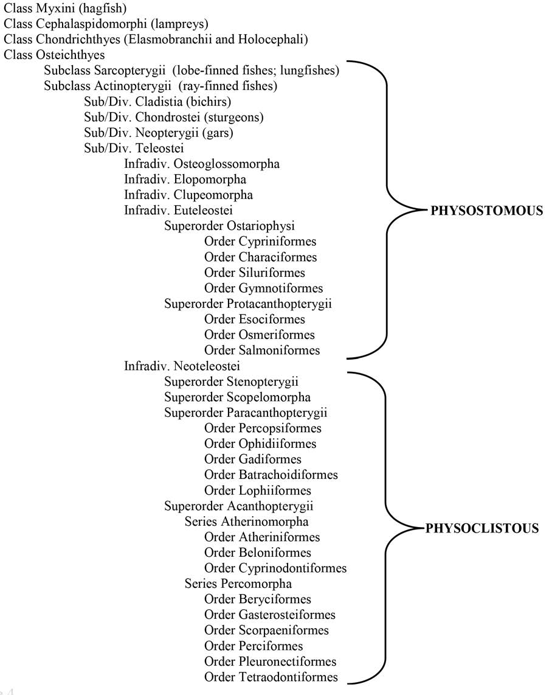
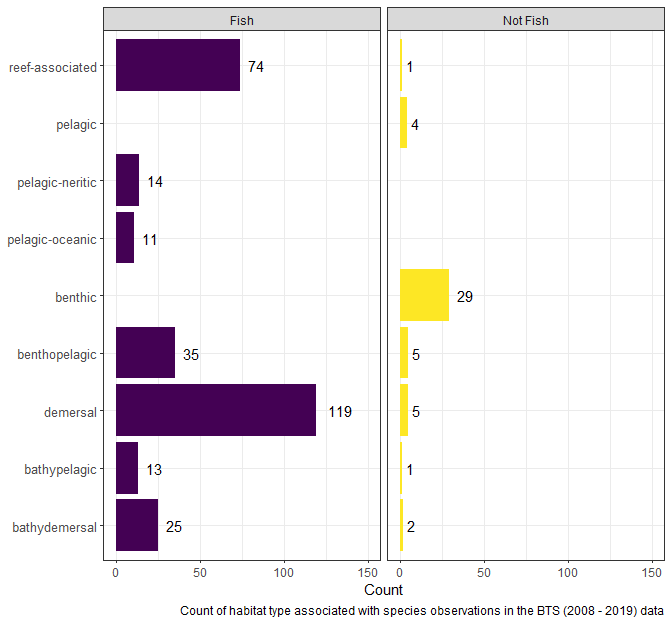
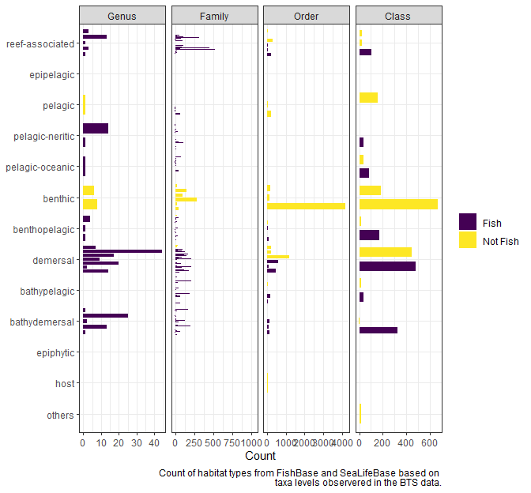

EDA 3 - Swim bladders and habitat
================
Erin LaBrecque
10/16/2020

This is file 3 of an exploratory data analysis (EDA) of the NEFSC Bottom
Trawl Survey catch counts from 2008 through 2019.

You must run the code in EDA 2 once to create and save the intermediate
files used in EDA 3.

``` r
knitr::opts_chunk$set(echo = TRUE, message = FALSE, warning = FALSE, 
                      fig.width = 7, fig.height = 6.5)
library(knitr)
library(tidyverse)
```

    ## Warning: package 'tibble' was built under R version 4.0.3

``` r
library(kableExtra)
```

    ## Warning: package 'kableExtra' was built under R version 4.0.3

``` r
library(rfishbase)
```

# Loading the data

This section loads the outputs from the first and second EDA files. It
will take a few moments to run because FishBase and SeaLifeBase are
loaded. Loading the databases here makes the rest of the code run
faster.

``` r
sp_fish <- read_rds("output_input/sp_fish.rds") 
sp_sealife <- read_rds("output_input/sp_sealife.rds")

# loading the fishbase and sealife base data sets
# this will speed up analysis later in the file
fish_taxa <- load_taxa(server = "fishbase")
sealife_taxa <- load_taxa(server = "sealifebase")
```

# Swim bladder information

After spending time working through `rfishbase` to find swim (gas)
bladder information, I am not sure `rfishbase` is the best resource to
use. The only table that has information on swim bladders is a table
called
[LARVAE](https://www.fishbase.in/manual/fishbasethe_larvae_table.htm)
with the fields `GasBladderEarly` and `GasBladderLate`. I think LARVAE
only has information on the larval development of swim bladders, and I’m
not sure how accurate it is. For example, when I looked at all the
species in the Order Gadiformes most of the swim bladder information is
listed as `NA`.

``` r
# getting all species of Gadiformes
gad <- species_list(Order = "Gadiformes")

# querying the larvae table to get info on early and late swim bladder development
# in all listed species of Gadiformes
gad_sb <- larvae(gad, fields = c("SpecCode", "Species", "GasBladderEarly",
                                          "GasBladderLate"))

# grouping the species by the larval development stage of the gas bladders and
# counting the combinations
gad_sb %>% 
  group_by(GasBladderEarly, GasBladderLate) %>% 
  summarize(n = n()) %>% 
  kable(col.names = c("Gas Bladder Early", "Gas Bladder Late", "Count"),
        caption = "Counts of combinations of early and late Gadiform gas bladder development from the LARVAE table in FishBase") %>% 
  kable_styling(bootstrap_options = c("striped", "hover"))
```

<table class="table table-striped table-hover" style="margin-left: auto; margin-right: auto;">

<caption>

Counts of combinations of early and late Gadiform gas bladder
development from the LARVAE table in FishBase

</caption>

<thead>

<tr>

<th style="text-align:left;">

Gas Bladder Early

</th>

<th style="text-align:left;">

Gas Bladder Late

</th>

<th style="text-align:right;">

Count

</th>

</tr>

</thead>

<tbody>

<tr>

<td style="text-align:left;">

invisible

</td>

<td style="text-align:left;">

invisible

</td>

<td style="text-align:right;">

18

</td>

</tr>

<tr>

<td style="text-align:left;">

pigmented

</td>

<td style="text-align:left;">

NA

</td>

<td style="text-align:right;">

1

</td>

</tr>

<tr>

<td style="text-align:left;">

visible

</td>

<td style="text-align:left;">

visible

</td>

<td style="text-align:right;">

6

</td>

</tr>

<tr>

<td style="text-align:left;">

NA

</td>

<td style="text-align:left;">

invisible

</td>

<td style="text-align:right;">

1

</td>

</tr>

<tr>

<td style="text-align:left;">

NA

</td>

<td style="text-align:left;">

NA

</td>

<td style="text-align:right;">

594

</td>

</tr>

</tbody>

</table>

``` r
# removing variables
rm(gad, gad_sb)
```

<br/>

According to Brown *et al.* (2014) all Gadiforms are physoclistous, so I
would assume that all species should have information about the early
and late stage development. I’m using Brown *et al.* (2014) as my swim
bladder paper reference because it is the only paper I’ve found that has
easily accessible information on which fish have have swim bladders. The
taxonomic classification in Brown *et al.* (2014) differs slightly from
[ITIS](www.itis.gov) classification.

Please let me know if there is an updated resource you would like me to
use.

``` r

```


> Brown, Richard S., Alison H. Colotelo, Brett D. Pflugrath, Craig A.
> Boys, Lee J. Baumgartner, Z. Daniel Deng, Luiz G. M. Silva, et
> al. “Understanding Barotrauma in Fish Passing Hydro Structures: A
> Global Strategy for Sustainable Development of Water Resources.”
> Fisheries 39, no. 3 (2014): 108–22.
> <https://doi.org/10.1080/03632415.2014.883570>.

<br/>

Looking a little deeper into the swim (gas) bladder data, some species
have more than one entry (`sp_fish` and `fish_sb` do not have the same
number of rows, which you will not see until you run the code in the
next section). After emailing with the maintainers of `rfishbase` (who
asked the FishBase people), I found out that this is not a mistake.
Please see our conversation in the [GitHub
issue](https://github.com/ropensci/rfishbase/issues/188) for more
details.

Basically, each row in the LARVAE table is a unique combination of
larvae area and stock code. I do not understand why this combination is
the unique identifier because I assumed species, no matter their stock
or location, would have the same development for something as pertinent
as a swim bladder. Again, I am not a fish biologist (or a taxonomist,
obviously).

And again, I do not think this table is actually helpful for the
information we are trying to get at, but this section will query the
LARVAE table and get the information for the species that are in the BTS
data sets. It might be useful down the line.

``` r
# querying the larvae table to get info on early and late swim bladder development
# for all fish species
sp_fish_sb <- larvae(sp_fish$DB_sp, fields = c("SpecCode", "Species", "GasBladderEarly",
                                          "GasBladderLate", "LarvalArea",
                                          "StockCode"), server = "fishbase") 
# printing out the duplicate values
sp_fish_sb %>%
  group_by(SpecCode) %>% 
  filter(n() > 1) %>% 
  ungroup() %>% 
  kable(caption = "Duplicated fish species in table LARVAE") %>% 
  kable_styling(bootstrap_options = c("stripped", "hover"))
```

<table class="table table-hover" style="margin-left: auto; margin-right: auto;">

<caption>

Duplicated fish species in table LARVAE

</caption>

<thead>

<tr>

<th style="text-align:right;">

SpecCode

</th>

<th style="text-align:left;">

Species

</th>

<th style="text-align:left;">

GasBladderEarly

</th>

<th style="text-align:left;">

GasBladderLate

</th>

<th style="text-align:left;">

LarvalArea

</th>

<th style="text-align:right;">

StockCode

</th>

</tr>

</thead>

<tbody>

<tr>

<td style="text-align:right;">

391

</td>

<td style="text-align:left;">

Brama brama

</td>

<td style="text-align:left;">

NA

</td>

<td style="text-align:left;">

NA

</td>

<td style="text-align:left;">

coastal waters off Geraldton (WA) and Sydney (NSW)

</td>

<td style="text-align:right;">

405

</td>

</tr>

<tr>

<td style="text-align:right;">

391

</td>

<td style="text-align:left;">

Brama brama

</td>

<td style="text-align:left;">

NA

</td>

<td style="text-align:left;">

NA

</td>

<td style="text-align:left;">

to be filled

</td>

<td style="text-align:right;">

405

</td>

</tr>

<tr>

<td style="text-align:right;">

24

</td>

<td style="text-align:left;">

Clupea harengus

</td>

<td style="text-align:left;">

NA

</td>

<td style="text-align:left;">

NA

</td>

<td style="text-align:left;">

Northeastern Atlantic (British coasts: Plymouth area); Northwestern
Atlantic (Delaware Bay)

</td>

<td style="text-align:right;">

32

</td>

</tr>

<tr>

<td style="text-align:right;">

24

</td>

<td style="text-align:left;">

Clupea harengus

</td>

<td style="text-align:left;">

NA

</td>

<td style="text-align:left;">

NA

</td>

<td style="text-align:left;">

Western Baltic, in coastal waters and estuaries

</td>

<td style="text-align:right;">

56760

</td>

</tr>

<tr>

<td style="text-align:right;">

6977

</td>

<td style="text-align:left;">

Arctozenus risso

</td>

<td style="text-align:left;">

absent

</td>

<td style="text-align:left;">

absent

</td>

<td style="text-align:left;">

Northeastern Pacific (California Current region); Northwestern Pacific
(Japan)

</td>

<td style="text-align:right;">

7297

</td>

</tr>

<tr>

<td style="text-align:right;">

6977

</td>

<td style="text-align:left;">

Arctozenus risso

</td>

<td style="text-align:left;">

invisible

</td>

<td style="text-align:left;">

invisible

</td>

<td style="text-align:left;">

to be filled

</td>

<td style="text-align:right;">

7297

</td>

</tr>

<tr>

<td style="text-align:right;">

1455

</td>

<td style="text-align:left;">

Etrumeus sadina

</td>

<td style="text-align:left;">

visible

</td>

<td style="text-align:left;">

visible

</td>

<td style="text-align:left;">

California Current region; Southern Australia; Japan

</td>

<td style="text-align:right;">

1648

</td>

</tr>

<tr>

<td style="text-align:right;">

1455

</td>

<td style="text-align:left;">

Etrumeus sadina

</td>

<td style="text-align:left;">

NA

</td>

<td style="text-align:left;">

NA

</td>

<td style="text-align:left;">

southern Australia

</td>

<td style="text-align:right;">

1648

</td>

</tr>

</tbody>

</table>

<br/>

This section removes all the duplicates from the LARVAE table query and
adds back in the rows that are relevant for the Northwest Atlantic. I
choose values that relevant to the Northwest Atlantic (or were the
default that was not the Northwest Atlantic). In one case (*Etrumeus
sadina*), I choose the option that was not solely “Australia”.

``` r
# picking the rows to keep
sp_fish_sb_tokeep <- sp_fish_sb %>% 
  group_by(SpecCode) %>% 
  filter(n() > 1) %>% 
  filter(LarvalArea == "to be filled" |
           str_detect(LarvalArea, "^Northeastern Atlantic") |
           str_detect(LarvalArea, "^California"))

# removing all duplicated SpecCode and adding the selected rows to keep
sp_fish_sb_no_dups <- sp_fish_sb %>% 
  group_by(SpecCode) %>% 
  filter(n() == 1) %>% 
  bind_rows(sp_fish_sb_tokeep)

# grouping the species by the larval development stage of the gas bladders and
# counting the combinations
sp_fish_sb_no_dups%>% 
  group_by(GasBladderEarly, GasBladderLate) %>% 
  summarize(n = n()) %>% 
  kable(col.names = c("Gas Bladder Early", "Gas Bladder Late", "Count"),
        caption = "Counts of combinations of early and late fish gas bladder development for the species in the BTS data from the LARVAE table in FishBase") %>% 
  kable_styling(bootstrap_options = c("striped", "hover"))
```

<table class="table table-striped table-hover" style="margin-left: auto; margin-right: auto;">

<caption>

Counts of combinations of early and late fish gas bladder development
for the species in the BTS data from the LARVAE table in FishBase

</caption>

<thead>

<tr>

<th style="text-align:left;">

Gas Bladder Early

</th>

<th style="text-align:left;">

Gas Bladder Late

</th>

<th style="text-align:right;">

Count

</th>

</tr>

</thead>

<tbody>

<tr>

<td style="text-align:left;">

invisible

</td>

<td style="text-align:left;">

invisible

</td>

<td style="text-align:right;">

14

</td>

</tr>

<tr>

<td style="text-align:left;">

invisible

</td>

<td style="text-align:left;">

visible

</td>

<td style="text-align:right;">

1

</td>

</tr>

<tr>

<td style="text-align:left;">

pigmented

</td>

<td style="text-align:left;">

pigmented

</td>

<td style="text-align:right;">

3

</td>

</tr>

<tr>

<td style="text-align:left;">

pigmented

</td>

<td style="text-align:left;">

NA

</td>

<td style="text-align:right;">

1

</td>

</tr>

<tr>

<td style="text-align:left;">

visible

</td>

<td style="text-align:left;">

visible

</td>

<td style="text-align:right;">

2

</td>

</tr>

<tr>

<td style="text-align:left;">

visible

</td>

<td style="text-align:left;">

NA

</td>

<td style="text-align:right;">

3

</td>

</tr>

<tr>

<td style="text-align:left;">

NA

</td>

<td style="text-align:left;">

NA

</td>

<td style="text-align:right;">

267

</td>

</tr>

</tbody>

</table>

``` r
# joining the swim bladder information to the fish species information
sp_fish <- sp_fish %>% 
  left_join(sp_fish_sb_no_dups, by = "SpecCode")

# writing out the swim bladder information
write_rds(sp_fish_sb_no_dups, "output_input/sp_fish_swimbladder_info.rds")

# remove intermediate files
rm(sp_fish_sb, sp_fish_sb_tokeep, sp_fish_sb_no_dups)
```

<br/>

# Habitat

The
[SPECIES](https://www.fishbase.se/manual/english/fishbasethe_species_table.htm)
table in FishBase has information on the depth range and the preferred
environment of each species. The following definitions are from the
website.

**Habitat**: Indicates the particular environment preferred by the
species, with the following choices (adapted from Holthus and Maragos
1995):

*pelagic*: occurring mainly in the water column between 0 and 200 m, not
feeding on benthic organisms;

*benthopelagic*: living and/or feeding on or near the bottom, as well as
in midwater, between 0 and 200 m;

*demersal*: living and/or feeding on or near the bottom, between 0 and
200 m;

*reef-associated*: living and/or feeding on or near reefs, between 0 and
200 m;

*bathypelagic*: occurring mainly in open water below 200 m, not feeding
on benthic organisms;

*bathydemersal*: living and/or feeding on or near the bottom, below 200
m.

> Holthus, P.F. and J.E. Maragos. 1995. Marine ecosystem classification
> for the tropical island Pacific, p. 239-278. In J.E. Maragos, M.N.A.
> Peterson, L.G. Eldredge, J.E. Bardach and H.F. Takeuchi (eds.) Marine
> and coastal biodiversity in the tropical island Pacific region. Vol.
> 1. Species Management and Information Management Priorities. East-West
> Center, Honolulu, Hawaii. 424 p. 

<br/>

*Pelagic-neritic*, *pleagic-oceanic*, and *reef-associated* are also
choices for preferred depth but definitions are not given on the
FishBase SPECIES table website.

*Pelagic-neritic*: the marine waters column above the continental shelf,
some definitions specify the low tide line to the shelf break;

*pleagic-oceanic*: living in all open water that is not pelagic-neritic;

*reef-associated*: associated with reefs.

*host*, *others*, *epipelagic*, and *epiphytic* are additional values
provided by SeaLifeBase. Unfortunately I have not been able to find out
what “others” refers to.

``` r
# retrieving information on depth range and habitat (demersal, pelagic, benthic, etc.)
# and joining to fish data frame
sp_fish<- species(sp_fish$DB_sp, fields = c("SpecCode", "FamCode", "DemersPelag",
                                               "DepthRangeShallow", "DepthRangeDeep"),
                     server = "fishbase") %>%
  left_join(sp_fish, by = "SpecCode") %>% 
  select(-Species.x) %>% 
  rename(Species = Species.y)
  
# retrieving information on depth range and habitat (demersal, pelagic, benthic, etc.)
# and joining to sealife data frame
sp_sealife <- species(sp_sealife$DB_sp, fields = c("SpecCode", "FamCode", "DemersPelag",
                                                     "DepthRangeShallow", "DepthRangeDeep"),
                        server = "sealifebase") %>% 
  left_join(sp_sealife, by = "SpecCode") 
```

<br/>

# Quick high-level summary of habitat for Fish and Not Fish species

**Note**: this is a plot of species habitat counts taken from database
information based on the species observed in the trawl data. These are
not actual counts of habitat associated with species captured in the
trawls. The graph of counts of habitat based on the trawl data is in the
next EDA file.

``` r
# setting up levels of habitat variables for plotting order
# hab_levs_1 <- c("reef-associated", "pelagic", "pelagic-neritic","pelagic-oceanic", 
#             "benthic", "benthopelagic", "demersal", "bathypelagic", "bathydemersal")

hab_levs_2 <- c("bathydemersal", "bathypelagic",  "demersal", "benthopelagic",
                "benthic", "pelagic-oceanic", "pelagic-neritic", "pelagic",
                "reef-associated")

labels <- c(fish = "Fish", not_fish = "Not Fish")

# plot of habitat types represented in the BTS data (species only)
sp_fish %>% 
  bind_rows(sp_sealife) %>% 
  count(type, DemersPelag) %>% 
  ggplot(aes(fct_relevel(DemersPelag, hab_levs_2), n, fill = type, label = n)) +
  geom_col() +
  geom_text(hjust = -0.5) +
  coord_flip() +
  facet_grid(~ type, labeller=labeller(type = labels)) +
  ylim(0, 150) +
  theme_bw() +
  theme(legend.position = "none") +
  scale_fill_viridis_d() +
  theme(axis.text.y = element_text(size = 10)) +
  labs(y = "Count",
       x = NULL, 
       caption = "Count of habitat type associated with species observations in the BTS (2008 - 2019) data")
```

<!-- -->

# Habitat for non-species observations

Habitat information in FishBase and SealifeBase is only available at the
species level. I wrote two functions in the next section to get all the
species of a taxa level listed as an observation in the BTS data, query
the database, and count the habitat levels. In the second EDA, I cleaned
up some of the taxa listings from the data sets. `non_sp_taxa_edit.csv`
is in the `output_csv` folder and needs to be read in for the rest of
the code to work.

``` r
# reading in the data edited for spelling mistakes and synonyms
non_sp <- read_csv("output_csv/non_sp_taxa_edit.csv") 

# ordering taxa levels
taxa_levels <- c("Genus", "Family", "Order", "Class")

#pat: pattern to find
#tpe - "fish" or "not_fish"
get_non_species <- function(pat, tpe){ 
  non_sp %>% 
    filter(str_detect(DB_sp, pattern = pat)) %>% 
    filter(type == tpe)
}

#taxa_filter: Family, Order, Genus, Class
#taxa_list: fish_taxa or sealife_taxa
#serv: "fishbase" or "sealifebase"
non_species_habitat_counts <- function(taxa_filter, taxa_list, serv){
  taxa_filter <-  enquo(taxa_filter)
 
  # empty list to populate
  datalist <- list()
  
  # for loop to pull out all the species in each family
  for (i in 1:nrow(sp_list)){
    intermediate <- taxa_list %>% 
      filter(!!taxa_filter == sp_list$DB_sp[i])
    
    # get the habitat information for each species and count them
    counts <- species(intermediate$Species, c("SpecCode", "DemersPelag"), server = serv) %>% 
      count(DemersPelag) %>%
      pivot_wider(names_from = DemersPelag, values_from = n)
    counts$i <- i
    datalist[[i]] <- counts
  } 
  # binding lists together in one data frame attaching it to fish_fam
 bind_rows(datalist) %>% 
   bind_cols(sp_list)
}
```

Running the functions in this section. Note that you should always
create `sp_list` for the taxa you are looking for before you run the
associated `non_species_habitat_counts()`.

``` r
# getting habitat counts for species in fish Genera
sp_list <- non_sp %>% 
  filter(!is.na(Genus),
         type == "fish")
fish_gen_hab_cnts <- non_species_habitat_counts(Genus, fish_taxa, "fishbase")

# getting habitat counts for species in fish Families
sp_list <- get_non_species("idae$", "fish")
fish_fam_hab_cnts <- non_species_habitat_counts(Family, fish_taxa, "fishbase")

# getting habitat counts for species in fish Orders
sp_list <- get_non_species("formes$", "fish")
fish_order_hab_cnts <- non_species_habitat_counts(Order, fish_taxa, "fishbase")

# getting habitat counts for species in fish Class
sp_list <- get_non_species("Elasmobranchii", "fish")
fish_class_hab_cnts <- non_species_habitat_counts(Class, fish_taxa, "fishbase")
  
# Now for the not_fish

# getting habitat counts for species in not_fish Genera
sp_list <- non_sp %>% 
  filter(!is.na(Genus),
         type == "not_fish")
not_fish_gen_hab_cnts <- non_species_habitat_counts(Genus, sealife_taxa, "sealifebase")

# getting habitat counts for species in not_fish Families
sp_list <- get_non_species("idae$", "not_fish")
not_fish_fam_hab_cnts <- non_species_habitat_counts(Family, sealife_taxa, "sealifebase")  


# getting habitat counts for species in not_fish Orders
sp_list <- get_non_species("poda$", "not_fish") %>% 
  filter(!is.na(Order))
not_fish_order_hab_cnts <- non_species_habitat_counts(Order, sealife_taxa, "sealifebase")

# getting habitat counts for species in not_fish Class
sp_list <- get_non_species("Asteroidea", "not_fish")
not_fish_class_hab_cnts_1 <- non_species_habitat_counts(Class, sealife_taxa, "sealifebase")

sp_list <- get_non_species("Cephalopoda", "not_fish")
not_fish_class_hab_cnts_2 <- non_species_habitat_counts(Class, sealife_taxa, "sealifebase")
```

### Putting the non-species habitat data into one data frame

``` r
non_sp_habitat <- bind_rows(fish_gen_hab_cnts, fish_fam_hab_cnts, fish_order_hab_cnts,
                            fish_class_hab_cnts, 
                            not_fish_gen_hab_cnts, not_fish_fam_hab_cnts,
                            not_fish_order_hab_cnts, not_fish_class_hab_cnts_1,
                            not_fish_class_hab_cnts_2)

# cleaning up the env by removing intermediate variables
rm(fish_gen_hab_cnts, fish_fam_hab_cnts, fish_order_hab_cnts,fish_class_hab_cnts, 
   not_fish_gen_hab_cnts, not_fish_fam_hab_cnts, not_fish_order_hab_cnts, 
   not_fish_class_hab_cnts_1, not_fish_class_hab_cnts_2, sp_list)
```

## Counts for non-species information

Rearranging the data for counts and plotting in this section.

``` r
non_sp_hab_long <- non_sp_habitat %>% 
  select(bathydemersal, demersal, benthopelagic, `reef-associated`, 
         `pelagic-neritic`, `pelagic-oceanic`, bathypelagic, pelagic, benthic,
         epipelagic, epiphytic, host, others, DB_sp) %>% 
  left_join(non_sp, by = "DB_sp") %>% 
  pivot_longer(cols = bathydemersal:others, names_to = "DemersPelag", values_to = "count") %>% 
  filter(!is.na(count)) %>% 
  mutate(level_f = factor(level, levels = taxa_levels))


hab_levs_3 <- c("others", "host", "epiphytic", "bathydemersal", "bathypelagic",  
                "demersal", "benthopelagic", "benthic", "pelagic-oceanic", 
                "pelagic-neritic", "pelagic", "epipelagic", "reef-associated")
```

## Non-species taxa levels

For the lowest level of taxonomic classification, there are 11 Genera
listed in the BTS data split between fish and non-fish species. Families
were the most represented with 48, and Orders (6) and Class (3) were the
least represented.

``` r
non_sp %>% 
  mutate(level = factor(level, levels = taxa_levels)) %>% 
  count(level, type) %>% 
  kable(col.names = c("Taxa level", "Type", "Count"),
        caoption = "Counts of taxa levels above Species in the BTS data") %>% 
  kable_styling(bootstrap_options = c("striped", "hover"))
```

<table class="table table-striped table-hover" style="margin-left: auto; margin-right: auto;">

<thead>

<tr>

<th style="text-align:left;">

Taxa level

</th>

<th style="text-align:left;">

Type

</th>

<th style="text-align:right;">

Count

</th>

</tr>

</thead>

<tbody>

<tr>

<td style="text-align:left;">

Genus

</td>

<td style="text-align:left;">

fish

</td>

<td style="text-align:right;">

9

</td>

</tr>

<tr>

<td style="text-align:left;">

Genus

</td>

<td style="text-align:left;">

not\_fish

</td>

<td style="text-align:right;">

2

</td>

</tr>

<tr>

<td style="text-align:left;">

Family

</td>

<td style="text-align:left;">

fish

</td>

<td style="text-align:right;">

42

</td>

</tr>

<tr>

<td style="text-align:left;">

Family

</td>

<td style="text-align:left;">

not\_fish

</td>

<td style="text-align:right;">

6

</td>

</tr>

<tr>

<td style="text-align:left;">

Order

</td>

<td style="text-align:left;">

fish

</td>

<td style="text-align:right;">

3

</td>

</tr>

<tr>

<td style="text-align:left;">

Order

</td>

<td style="text-align:left;">

not\_fish

</td>

<td style="text-align:right;">

3

</td>

</tr>

<tr>

<td style="text-align:left;">

Class

</td>

<td style="text-align:left;">

fish

</td>

<td style="text-align:right;">

1

</td>

</tr>

<tr>

<td style="text-align:left;">

Class

</td>

<td style="text-align:left;">

not\_fish

</td>

<td style="text-align:right;">

2

</td>

</tr>

</tbody>

</table>

<br/>

### Habitat count for non-species classifications

Because the habitat data for taxa levels above species was complied by
tallying the habitat value for each species within the taxa, these data
provide the possible range of habitat values for the taxa, not
necessarily the true habitat range for organisms collected.

I am not sure how useful this figure is, but here is how to read it: the
length of each bar represents the number of species in the taxa level
with that habitat type. For example, of the nine fish Genera listed as
the lowest taxonomic classification in the BTS data, five of them have
species with reef-associated habitats, two Genera have species with
pelagic-neritic habitats, one Genus has species in a pelagic-oceanic
habitat, three Genera have species with benthopelagic habitat, seven
Genera have species with demersal habitats and five Genera have species
with bathydemersal habitats. Of the two not-fish Genera listed as the
lowest taxonomic classification in the BTS data, one Genus has species
with pelagic habitat and two Genera have species with benthic habitat.

All the taxonomic levels can have species that range over the habitat
types. Because FishBase and SeaLifeBase only provide habitat information
at the species level, using the species data might not be useful.

``` r
non_sp_hab_long %>%
  ggplot(aes(fct_relevel(DemersPelag, hab_levs_3), count, fill = type)) +
  geom_col(position =  position_dodge2(padding = 0.3)) +
  scale_fill_viridis_d(labels = c("Fish", "Not Fish")) +
  coord_flip() +
  facet_grid(~ level_f, scales = "free_x") +
  theme_bw() +
  labs(y = "Count",
       x = NULL, 
       caption = "Count of habitat types from FishBase and SeaLifeBase based on \n taxa levels observered in the BTS data.", 
       fill = NULL)
```

<!-- -->

<br/>

# Wrap up EDA 3

Lots of data munging going on in this EDA. Not a lot of outputs, but the
data are mostly clean and they have habitat information and the weird
swim bladder information for fish species. Un-comment (remove \#) to
write out the data files.

``` r
write_rds(non_sp, "output_input/non_sp.rds")
write_rds(sp_fish, "output_input/sp_fish_2.rds")
write_rds(sp_sealife, "output_input/sp_sealife_2.rds")
write_rds(non_sp_habitat, "output_input/non_sp_habitat.rds")
```
