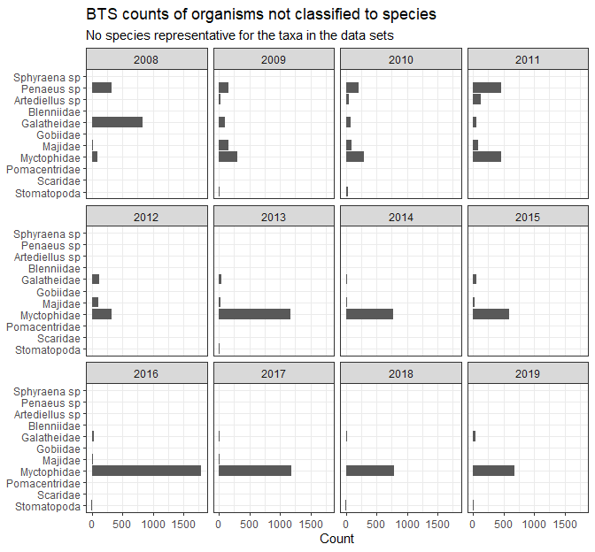
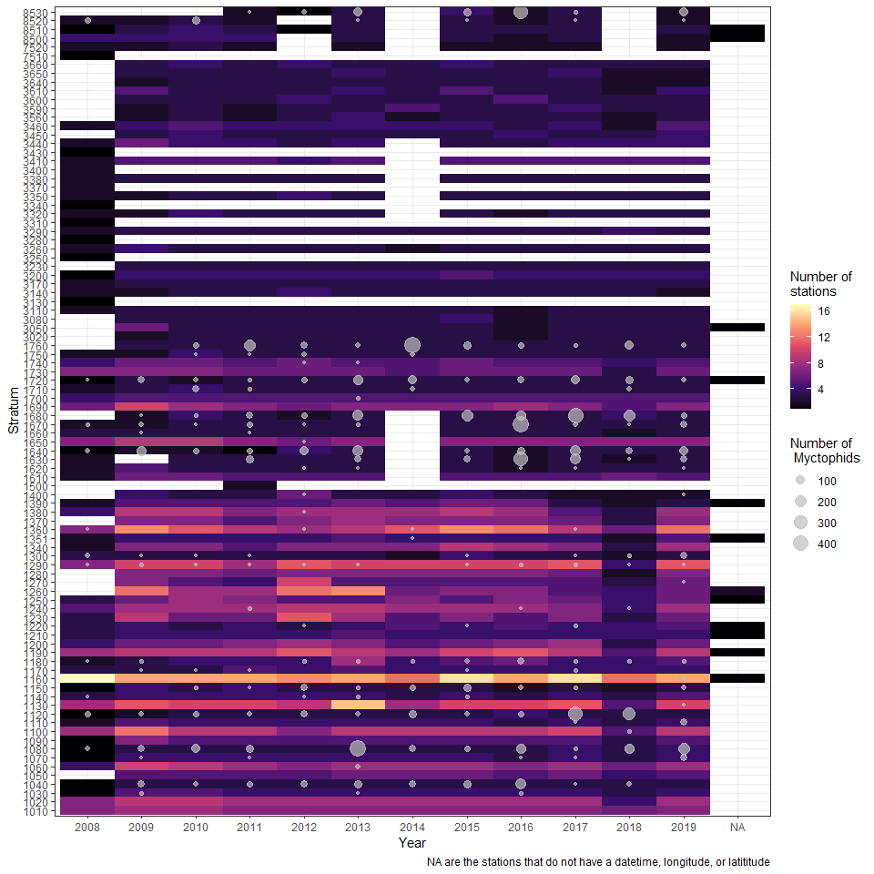
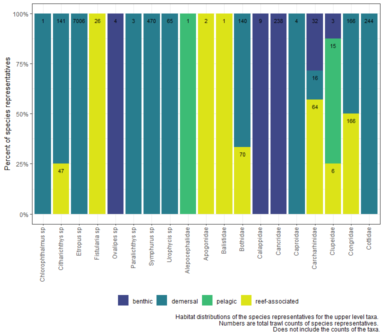
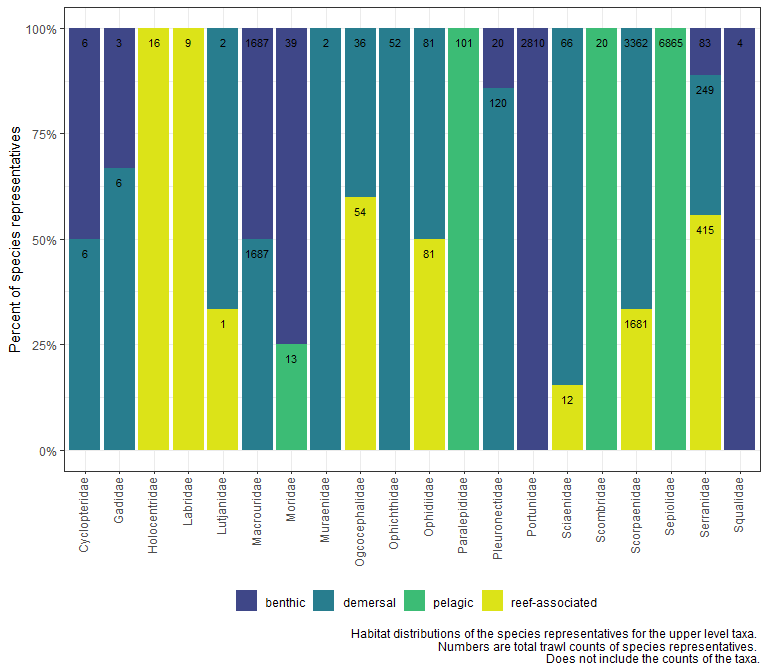
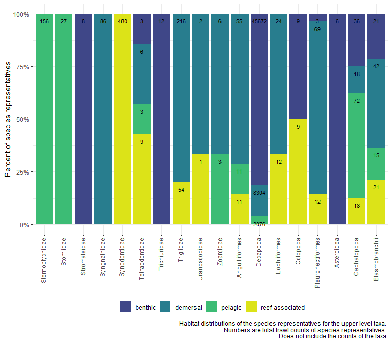
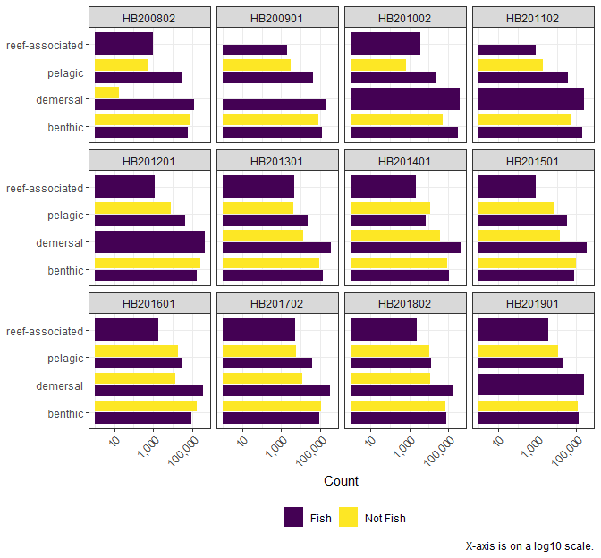
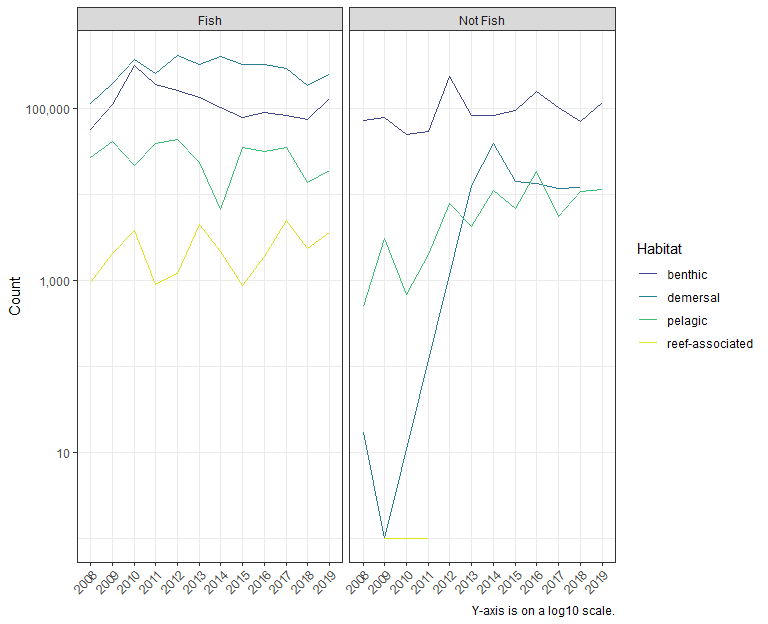

EDA 5 - Updated habitat and swim bladders
================
Erin LaBrecque
11/20/2020

This is file 5 of an exploratory data analysis (EDA) of the NEFSC Bottom
Trawl Survey catch counts from 2008 through 2019.

EDA 1 cleans the species data using FishBase and SeaLifeBase.  
EDA 2 lists out all the species names, does some more name cleaning, and
combines the species information with the trawl count data. EDA 3
queries FishBase for swim bladder information (but I do not trust it)
and SeaLifeBase and FishBase for habitat information.  
EDA 4 finds the spatial mismatches between strata listed in the survey
data and the strata shapefile, and provides some basic count plots.

This EDA cleans up the habitat and swim bladder section. This EDA is a
more “manual” than “programmatic” because I cannot find a database that
can be accessed to retrieve this information.

``` r
knitr::opts_chunk$set(echo = TRUE, message = FALSE, warning = FALSE, 
                      fig.width = 7, fig.height = 6.5)
library(knitr)
library(tidyverse)
```

    ## Warning: package 'tibble' was built under R version 4.0.3

``` r
library(lubridate)
```

    ## Warning: package 'lubridate' was built under R version 4.0.3

``` r
library(kableExtra)
```

    ## Warning: package 'kableExtra' was built under R version 4.0.3

``` r
# library(sf)
# library(leaflet)
```

# Loading the data

These are the outputs from the first and third EDA files. No data files
from EDA 4 were manipulated or saved as updated files. For the
observations that could not be classified to species,
`non_sp_taxa_edit_sb_hab.csv` (should be in the `ouput_csv` folder) is a
manual update of the swim bladder data.

``` r
dta <- read_rds("output_input/dta.rds") # original BTS trawl data (I always keep as a reference)
dta_ed <- read_rds("output_input/dta_ed.rds") # original BTS trawl data in tidy format, 0 counts removed

sp_fish <- read_rds("output_input/sp_fish_2.rds") # fish species information
sp_sealife <- read_rds("output_input/sp_sealife_2.rds") # all non-fish species information

non_sp <- read_rds("output_input/non_sp.rds") # fish and not-fish that could not be classified to species
#non_sp_habitat <- read_rds("output_input/non_sp_habitat.rds") # wide form of fish and non-fish that could not be classified to species with counts of species (re: habitat) for each taxa classification 

#manual_non_sp <- read_csv("output_csv/non_sp_taxa_edit_sb_hab.csv") # manual addition of swim bladder information of non-species observations
```

## Habitat frequency distribution of BTS observations not classified to species.

There is probably an easier way to do this, but I am writing all this
out step by step to keep things clear in my mind.

Any observation in the BTS data that was classified to species now has a
habitat designation (see the field `DemersPelag` in `sp_fish` and
`sp_sealife` or look back at EDA 3). In the following section, I
separate out the taxa for organisms that were not identified to species.
This list is then split into two groups. 1) Those taxa that have a
species representative, and 2) those taxa that do not have a species
representative.

An example of a species representative: the Family Apogonidae
(cardinalfishes) is listed as an observation in the BTS data. The
twospot cardinal fish, *Apogon pseudomaculatus*, is in the Family
Apogonidae and also listed as an observation in the BTS data. This
species is what I would call a “representative species” for the Family
observation. In this case, it is the only species in the data with the
Family Apogonidae, but there are other instances of Genera, Families,
Classes, and Orders that have more than one species representative in
the data. *Apogon pseudomaculatus* and Apogonidae were all collected in
the same strata and during the same months, so I am going to assign the
habitat for *Apogon pseudomaculatus* to the observation of Family
Apogonidae. For instances where there is more than one species
representative for a taxon, I will look at the strata, months, habitat,
and breakdown of catch counts of each species to see if there are
habitat weights that can be assigned and will break the trawl count data
according to those weights.

I am not quite sure what to do for taxa that do not have a species
representative, yet.

Because there are multiple taxa levels involved, I wrote a two functions
to look at what was and was not a species representative by taxa level.
It was easier to break them out by the “having species representative”
and “not having species representatives”.

*Side note:* There is a great, little custom operator (`%nin%`) in the
code block below for “not in”. When using look-up lists and tables, a
lot of filtering or subsetting is done by comparing lists - are values
in one list in another list? To do that in R, you use: `%in%`. It is a
logical operator (output is `TRUE` or `FALSE`), that provides the means
to filter or subset observations. You can negate `%in%` (flip the
filter) by adding `!` to the variable preceding `%in%`, but sometimes
you need the answer the question, “what is not in the list?”, and that
can be different than negating. There is nothing hardwired into R for
not-in, that’s where the custom operator, “not in”, comes in.

``` r
non_sp %>% 
  count(level) %>% 
  kable() %>% 
  kable_styling()
```

<table class="table" style="margin-left: auto; margin-right: auto;">

<thead>

<tr>

<th style="text-align:left;">

level

</th>

<th style="text-align:right;">

n

</th>

</tr>

</thead>

<tbody>

<tr>

<td style="text-align:left;">

Class

</td>

<td style="text-align:right;">

3

</td>

</tr>

<tr>

<td style="text-align:left;">

Family

</td>

<td style="text-align:right;">

48

</td>

</tr>

<tr>

<td style="text-align:left;">

Genus

</td>

<td style="text-align:right;">

11

</td>

</tr>

<tr>

<td style="text-align:left;">

Order

</td>

<td style="text-align:right;">

6

</td>

</tr>

</tbody>

</table>

``` r
# need to add the "sp" back into BTS_sp and keep the misspellings to filter the 
# BTS count data 
select_list <- non_sp %>% 
  select(BTS_sp, Com_name, DB_sp, level, type) %>% 
  mutate(BTS_misspl = case_when(level == "Genus" ~ paste0(BTS_sp, " sp"), 
                            TRUE ~ BTS_sp))

# combining fish and non-fish data that has all the habitat information
# also combing the habitat options into pelagic, benthic, demersal, and reef-associated
both_fish_sealife <- bind_rows(sp_fish, sp_sealife) %>% 
  mutate(habitat = case_when(DemersPelag %in% c("pelagic", "bathypelagic", 
                                                "pelagic-neritic", "pelagic-oceanic") ~ "pelagic",
                             DemersPelag %in% c("benthic", "benthopelagic") ~ "benthic",
                             DemersPelag %in% c("demersal", "bathydemersal") ~ "demersal",
                             TRUE ~ DemersPelag))

# quick function for "not in"
`%nin%` = Negate(`%in%`)

# function to find species in the BTS data associated with a higher taxon level of 
# observation that could not be ID'd to species. 

get_sp_in_taxon <- function(taxon_filter, col_nm, ls_index){
  col_nm <- enquo(col_nm)
  ls_index <- enquo(ls_index)
  
  # this is for the join, roder here matters
  by = set_names(quo_name(ls_index), quo_name(col_nm))
  
  ls <- select_list %>% 
    filter(level == taxon_filter)
  
  ls_in_BTS <- both_fish_sealife %>% 
    filter(!!col_nm %in% ls$DB_sp) %>% 
    mutate(level = taxon_filter,
           inBTSdata = "in") %>% 
    left_join(select(ls, !!ls_index, BTS_misspl), by = by)
}


# another function to find the upper level taxa that do not have species 
# representation in the BTS data
get_sp_notin_taxon <- function(taxon_filter, col_nm){
  col_nm <- enquo(col_nm)
  
  ls <- select_list %>% 
    filter(level == taxon_filter)

  ls_in_BTS <- both_fish_sealife %>%
    filter(!!col_nm %in% ls$DB_sp) %>%
    select(!!col_nm) %>%
    distinct() %>%
    unlist()
  
  ls_notin_BTS <- ls %>% 
    filter(DB_sp %nin% ls_in_BTS) %>%
    mutate(inBTSdata = "not")
}
```

Running the functions

``` r
gen_ <- get_sp_in_taxon("Genus", Genus, DB_sp)
fam_ <- get_sp_in_taxon("Family", Family, DB_sp)
ord_ <- get_sp_in_taxon("Order", Order, DB_sp)
cls_ <- get_sp_in_taxon("Class", Class, DB_sp)

# variable name (nosp_yeshab): "not id'ed to species, yes species reps with habitat information"
nosp_yeshab <- 
  bind_rows(gen_, fam_, ord_, cls_) %>% 
  select(-BTS_sp) %>%
  mutate(BTS_sp = case_when(level == "Genus" ~ paste0(Genus, " sp"),
                            level == "Family" ~ Family,
                            level == "Order" ~ Order,
                            level == "Class" ~ Class,
                            TRUE ~ "NA") )

gen_no <- get_sp_notin_taxon("Genus", Genus)
fam_no <- get_sp_notin_taxon("Family", Family)
ord_no <- get_sp_notin_taxon("Order", Order)
cls_no <- get_sp_notin_taxon("Class", Class)

# variable name (nosp_nohab): "not id'ed to species, no species reps with habitat information"
nosp_nohab <- 
  bind_rows(gen_no, fam_no, ord_no, cls_no)

# removing detritus  
rm(gen_, fam_, ord_, cls_, gen_no, fam_no, ord_no, cls_no)
```

Taxa observations that do not have a species in the BTS data to
represent them.

``` r
nosp_nohab %>%
  select(BTS_sp, Com_name, level, type) %>% 
  kable(col.names = c("BTS Observation", "Common name", "Level", "Type"),
        caption = "BTS observations that do not have species representatives in the BTS data") %>% 
  kable_styling(bootstrap_options = c("striped", "hover"))
```

<table class="table table-striped table-hover" style="margin-left: auto; margin-right: auto;">

<caption>

BTS observations that do not have species representatives in the BTS
data

</caption>

<thead>

<tr>

<th style="text-align:left;">

BTS Observation

</th>

<th style="text-align:left;">

Common name

</th>

<th style="text-align:left;">

Level

</th>

<th style="text-align:left;">

Type

</th>

</tr>

</thead>

<tbody>

<tr>

<td style="text-align:left;">

Artediellus

</td>

<td style="text-align:left;">

Sculpins

</td>

<td style="text-align:left;">

Genus

</td>

<td style="text-align:left;">

fish

</td>

</tr>

<tr>

<td style="text-align:left;">

Penaeus

</td>

<td style="text-align:left;">

Prawns

</td>

<td style="text-align:left;">

Genus

</td>

<td style="text-align:left;">

not\_fish

</td>

</tr>

<tr>

<td style="text-align:left;">

Sphyraena

</td>

<td style="text-align:left;">

Barracuda

</td>

<td style="text-align:left;">

Genus

</td>

<td style="text-align:left;">

fish

</td>

</tr>

<tr>

<td style="text-align:left;">

Blenniidae

</td>

<td style="text-align:left;">

Combtooth blenny

</td>

<td style="text-align:left;">

Family

</td>

<td style="text-align:left;">

fish

</td>

</tr>

<tr>

<td style="text-align:left;">

Galatheidae

</td>

<td style="text-align:left;">

Squat lobsters

</td>

<td style="text-align:left;">

Family

</td>

<td style="text-align:left;">

not\_fish

</td>

</tr>

<tr>

<td style="text-align:left;">

Gobiidae

</td>

<td style="text-align:left;">

True gobies

</td>

<td style="text-align:left;">

Family

</td>

<td style="text-align:left;">

fish

</td>

</tr>

<tr>

<td style="text-align:left;">

Majidae

</td>

<td style="text-align:left;">

Crabs

</td>

<td style="text-align:left;">

Family

</td>

<td style="text-align:left;">

not\_fish

</td>

</tr>

<tr>

<td style="text-align:left;">

Myctophidae

</td>

<td style="text-align:left;">

Lanternfish

</td>

<td style="text-align:left;">

Family

</td>

<td style="text-align:left;">

fish

</td>

</tr>

<tr>

<td style="text-align:left;">

Pomacentridae

</td>

<td style="text-align:left;">

Damselfishes, clownfishes

</td>

<td style="text-align:left;">

Family

</td>

<td style="text-align:left;">

fish

</td>

</tr>

<tr>

<td style="text-align:left;">

Scaridae

</td>

<td style="text-align:left;">

Parrotfishes

</td>

<td style="text-align:left;">

Family

</td>

<td style="text-align:left;">

fish

</td>

</tr>

<tr>

<td style="text-align:left;">

Stomatopoda

</td>

<td style="text-align:left;">

Mantis shrimp

</td>

<td style="text-align:left;">

Order

</td>

<td style="text-align:left;">

not\_fish

</td>

</tr>

</tbody>

</table>

<br/>

``` r
# adding whether the non-species have a representative species or not 
select_list <- select_list %>% 
  mutate(sp_represent = ifelse(BTS_misspl %in% nosp_nohab$BTS_misspl, "no", "yes"))

# filtering the BTS data for all observations that are not species and do not have
# a species representative (aka, no habitat information to work with)
BTS_dta_nosp_nohab <- dta_ed %>% 
  filter(taxa %in% nosp_nohab$BTS_misspl)

# filtering the BTS data for all observations that are not species but do have a 
# species representative
BTS_dta_nosp_yeshab <- dta_ed %>% 
  filter(taxa %in% nosp_yeshab$BTS_misspl)
```

These are the counts of BTS observations that do not have a species
representative.

``` r
# nosp_no_dist_levels_1 <- c("Artediellus sp", "Penaeus sp", "Sphyraena sp",
#                          "Blenniidae", "Galatheidae", "Gobiidae", "Majidae",
#                          "Myctophidae", "Pomacentridae", "Scaridae", "Stomatopoda")

nosp_no_dist_levels_2 <- c("Stomatopoda", "Scaridae", "Pomacentridae", "Myctophidae",
                           "Majidae", "Gobiidae", "Galatheidae", "Blenniidae",
                           "Artediellus sp", "Penaeus sp", "Sphyraena sp")

BTS_dta_nosp_nohab %>% 
  filter(!is.na(year)) %>%
  group_by(taxa, year) %>% 
  summarize(nb = sum(count)) %>% 
  ggplot(aes(fct_relevel(taxa, nosp_no_dist_levels_2), nb)) +
  geom_col() +
  facet_wrap(~ year) +
  coord_flip() +
  theme_bw() +
  labs(x = NULL,
       y = "Count",
       title = "BTS counts of organisms not classified to species",
       subtitle = "No species representative for the taxa in the data sets")
```

<!-- -->

``` r
# This is a line graph of counts by year colored by taxa, but it's hard to read

# BTS_dta_nosp_nohab %>% 
#   filter(!is.na(year)) %>%
#   mutate(year = as.factor(year)) %>% 
#   group_by(taxa, year) %>% 
#   summarize(nb = sum(count)) %>%
#   ggplot(aes(year, nb, group = taxa, color = taxa)) +
#   geom_line() +
#   theme_bw()
```

<br/>

I am a little surprised that there are no species representatives of the
Family Myctophidae in the trawl data. I also think it is interesting
that Myctophidae trawl counts jump from 324 in 2012 to 1176 in 2013 and
stay above 500 through 2019. I wonder if that was part of the shelf
warming that started in 2011 or if sampling shifted to the shelf break.

I did not have time to make density surfaces of sampling effort and
catches to check if sampling effort shifted or if myctophid distribution
shifted, but I was able to plot out the myctophid catches in relation to
all the sampled strata. The graph below is a heatmap of the amount of
stations sampled in a stratum each year and the number of myctophids
caught in each stratum.

It *looks* like there was a similar amount of sampling effort between
2012 and 2013 and there was an increase in the amount of myctophids
caught in stratum 1080 in 2013. Looking at full time line, it looks like
2012 was the anomalous year in that no myctophids were caught in stratum
1080 but were caught in similar quantities in all other years. Again,
I’m just eyeballing the graph and I have not plotted out which
stations in each strata were sampled.

``` r
BTS_dta_nosp_nohab %>% 
  filter(!is.na(year)) %>%
  group_by(taxa, year) %>% 
  summarize(nb = sum(count)) %>% 
  filter(taxa == "Myctophidae") %>% 
  kable(col.names = c("Taxa", "Year", "Total count")) %>% 
  kable_styling(bootstrap_options = c("striped", "hover"))
```

<table class="table table-striped table-hover" style="margin-left: auto; margin-right: auto;">

<thead>

<tr>

<th style="text-align:left;">

Taxa

</th>

<th style="text-align:right;">

Year

</th>

<th style="text-align:right;">

Total count

</th>

</tr>

</thead>

<tbody>

<tr>

<td style="text-align:left;">

Myctophidae

</td>

<td style="text-align:right;">

2008

</td>

<td style="text-align:right;">

87

</td>

</tr>

<tr>

<td style="text-align:left;">

Myctophidae

</td>

<td style="text-align:right;">

2009

</td>

<td style="text-align:right;">

296

</td>

</tr>

<tr>

<td style="text-align:left;">

Myctophidae

</td>

<td style="text-align:right;">

2010

</td>

<td style="text-align:right;">

292

</td>

</tr>

<tr>

<td style="text-align:left;">

Myctophidae

</td>

<td style="text-align:right;">

2011

</td>

<td style="text-align:right;">

455

</td>

</tr>

<tr>

<td style="text-align:left;">

Myctophidae

</td>

<td style="text-align:right;">

2012

</td>

<td style="text-align:right;">

324

</td>

</tr>

<tr>

<td style="text-align:left;">

Myctophidae

</td>

<td style="text-align:right;">

2013

</td>

<td style="text-align:right;">

1176

</td>

</tr>

<tr>

<td style="text-align:left;">

Myctophidae

</td>

<td style="text-align:right;">

2014

</td>

<td style="text-align:right;">

773

</td>

</tr>

<tr>

<td style="text-align:left;">

Myctophidae

</td>

<td style="text-align:right;">

2015

</td>

<td style="text-align:right;">

587

</td>

</tr>

<tr>

<td style="text-align:left;">

Myctophidae

</td>

<td style="text-align:right;">

2016

</td>

<td style="text-align:right;">

1796

</td>

</tr>

<tr>

<td style="text-align:left;">

Myctophidae

</td>

<td style="text-align:right;">

2017

</td>

<td style="text-align:right;">

1191

</td>

</tr>

<tr>

<td style="text-align:left;">

Myctophidae

</td>

<td style="text-align:right;">

2018

</td>

<td style="text-align:right;">

790

</td>

</tr>

<tr>

<td style="text-align:left;">

Myctophidae

</td>

<td style="text-align:right;">

2019

</td>

<td style="text-align:right;">

682

</td>

</tr>

</tbody>

</table>

``` r
# BTS_dta_nosp_nohab %>% 
#   filter(taxa == "Myctophidae") %>%
#   filter(!is.na(year)) %>%
#   group_by(year, stratum) %>% 
#   summarize(nb = sum(count)) %>% 
#   ggplot(aes(factor(year), nb)) +
#   geom_col() +
#   facet_wrap(~ stratum, scales = "free_y") +
#   theme_bw() +
#   theme(axis.text.x = element_text(angle = 90, vjust = 0.25, hjust = 1))
```

``` r
mycto <- BTS_dta_nosp_nohab %>% 
  filter(taxa == "Myctophidae") %>%
  group_by(year, stratum) %>% 
  summarize(nb = sum(count))


dta %>% 
  mutate(year = year(begindatetime)) %>% 
  group_by(year, stratum) %>% 
  summarize(nb_station = n()) %>% 
  ggplot() +
  geom_tile(aes(factor(year), factor(stratum), fill = nb_station)) +
  scale_fill_viridis_c(option = "magma") +
  geom_point(data = mycto, aes(factor(year), factor(stratum), size = nb), 
             color = "grey", alpha = 0.7) +
  theme_bw() +
  labs(x = "Year", 
       y = "Stratum",
       fill = "Number of\nstations",
       size = "Number of\n Myctophids",
       caption = "NA are the stations that do not have a datetime, longitude, or latititude"  )
```

<!-- -->

``` r
dta_ed %>% 
  filter(taxa == "Myctophidae",
         stratum == 1080) %>% 
  group_by(year) %>% 
  summarize(nb_mycto = sum(count)) %>%
  # Have to add a 0 for 2012 or it does not show up in the plot
  bind_rows(tibble(year = 2012, nb_mycto = 0)) %>% 
  ungroup() %>% 
  ggplot(aes(factor(year), nb_mycto)) +
  geom_col() +
  theme_bw() +
  labs(x = "Year",
       y = "Number",
       caption = "Number of myctophids caught in stratum 1080.")
```

<!-- -->

## Habitat distributions of the species representatives

This is a two part process. First, we need to see what the habitat
distribution of the species representatives for the upper level taxa
look like. Second, we assign the upper level taxa habitat(s) based on
the weights from the species representatives.

I have not mapped out the data to see if the species representatives are
found in the same strata as the upper level taxa they are associated
with (do not forget that some strata listed in the BTS data DO NOT match
the strata in the shapefile.).

``` r
nosp_yeshab %>%
  count(BTS_sp, level, type) %>% 
  mutate(level = factor(level, levels = c("Genus", "Family", "Order", "Class"))) %>% 
  arrange(level) %>% 
  kable(col.names =  c("BTS Observation", "Level", "Type", 
                       "Number of species <br/>representatives"),
        caption = "Number of species representatives for BTS observations",
        escape = FALSE) %>% 
  kable_styling(bootstrap_options = c("striped", "hover"))
```

<table class="table table-striped table-hover" style="margin-left: auto; margin-right: auto;">

<caption>

Number of species representatives for BTS observations

</caption>

<thead>

<tr>

<th style="text-align:left;">

BTS Observation

</th>

<th style="text-align:left;">

Level

</th>

<th style="text-align:left;">

Type

</th>

<th style="text-align:right;">

Number of species <br>representatives

</th>

</tr>

</thead>

<tbody>

<tr>

<td style="text-align:left;">

Chlorophthalmus sp

</td>

<td style="text-align:left;">

Genus

</td>

<td style="text-align:left;">

fish

</td>

<td style="text-align:right;">

1

</td>

</tr>

<tr>

<td style="text-align:left;">

Citharichthys sp

</td>

<td style="text-align:left;">

Genus

</td>

<td style="text-align:left;">

fish

</td>

<td style="text-align:right;">

4

</td>

</tr>

<tr>

<td style="text-align:left;">

Etropus sp

</td>

<td style="text-align:left;">

Genus

</td>

<td style="text-align:left;">

fish

</td>

<td style="text-align:right;">

2

</td>

</tr>

<tr>

<td style="text-align:left;">

Fistularia sp

</td>

<td style="text-align:left;">

Genus

</td>

<td style="text-align:left;">

fish

</td>

<td style="text-align:right;">

2

</td>

</tr>

<tr>

<td style="text-align:left;">

Ovalipes sp

</td>

<td style="text-align:left;">

Genus

</td>

<td style="text-align:left;">

not\_fish

</td>

<td style="text-align:right;">

2

</td>

</tr>

<tr>

<td style="text-align:left;">

Paralichthys sp

</td>

<td style="text-align:left;">

Genus

</td>

<td style="text-align:left;">

fish

</td>

<td style="text-align:right;">

3

</td>

</tr>

<tr>

<td style="text-align:left;">

Symphurus sp

</td>

<td style="text-align:left;">

Genus

</td>

<td style="text-align:left;">

fish

</td>

<td style="text-align:right;">

1

</td>

</tr>

<tr>

<td style="text-align:left;">

Urophycis sp

</td>

<td style="text-align:left;">

Genus

</td>

<td style="text-align:left;">

fish

</td>

<td style="text-align:right;">

5

</td>

</tr>

<tr>

<td style="text-align:left;">

Alepocephalidae

</td>

<td style="text-align:left;">

Family

</td>

<td style="text-align:left;">

fish

</td>

<td style="text-align:right;">

1

</td>

</tr>

<tr>

<td style="text-align:left;">

Apogonidae

</td>

<td style="text-align:left;">

Family

</td>

<td style="text-align:left;">

fish

</td>

<td style="text-align:right;">

1

</td>

</tr>

<tr>

<td style="text-align:left;">

Balistidae

</td>

<td style="text-align:left;">

Family

</td>

<td style="text-align:left;">

fish

</td>

<td style="text-align:right;">

1

</td>

</tr>

<tr>

<td style="text-align:left;">

Bothidae

</td>

<td style="text-align:left;">

Family

</td>

<td style="text-align:left;">

fish

</td>

<td style="text-align:right;">

3

</td>

</tr>

<tr>

<td style="text-align:left;">

Calappidae

</td>

<td style="text-align:left;">

Family

</td>

<td style="text-align:left;">

not\_fish

</td>

<td style="text-align:right;">

1

</td>

</tr>

<tr>

<td style="text-align:left;">

Cancridae

</td>

<td style="text-align:left;">

Family

</td>

<td style="text-align:left;">

not\_fish

</td>

<td style="text-align:right;">

2

</td>

</tr>

<tr>

<td style="text-align:left;">

Caproidae

</td>

<td style="text-align:left;">

Family

</td>

<td style="text-align:left;">

fish

</td>

<td style="text-align:right;">

2

</td>

</tr>

<tr>

<td style="text-align:left;">

Carcharhinidae

</td>

<td style="text-align:left;">

Family

</td>

<td style="text-align:left;">

fish

</td>

<td style="text-align:right;">

7

</td>

</tr>

<tr>

<td style="text-align:left;">

Clupeidae

</td>

<td style="text-align:left;">

Family

</td>

<td style="text-align:left;">

fish

</td>

<td style="text-align:right;">

8

</td>

</tr>

<tr>

<td style="text-align:left;">

Congridae

</td>

<td style="text-align:left;">

Family

</td>

<td style="text-align:left;">

fish

</td>

<td style="text-align:right;">

2

</td>

</tr>

<tr>

<td style="text-align:left;">

Cottidae

</td>

<td style="text-align:left;">

Family

</td>

<td style="text-align:left;">

fish

</td>

<td style="text-align:right;">

4

</td>

</tr>

<tr>

<td style="text-align:left;">

Cyclopteridae

</td>

<td style="text-align:left;">

Family

</td>

<td style="text-align:left;">

fish

</td>

<td style="text-align:right;">

2

</td>

</tr>

<tr>

<td style="text-align:left;">

Gadidae

</td>

<td style="text-align:left;">

Family

</td>

<td style="text-align:left;">

fish

</td>

<td style="text-align:right;">

3

</td>

</tr>

<tr>

<td style="text-align:left;">

Holocentridae

</td>

<td style="text-align:left;">

Family

</td>

<td style="text-align:left;">

fish

</td>

<td style="text-align:right;">

2

</td>

</tr>

<tr>

<td style="text-align:left;">

Labridae

</td>

<td style="text-align:left;">

Family

</td>

<td style="text-align:left;">

fish

</td>

<td style="text-align:right;">

3

</td>

</tr>

<tr>

<td style="text-align:left;">

Lutjanidae

</td>

<td style="text-align:left;">

Family

</td>

<td style="text-align:left;">

fish

</td>

<td style="text-align:right;">

3

</td>

</tr>

<tr>

<td style="text-align:left;">

Macrouridae

</td>

<td style="text-align:left;">

Family

</td>

<td style="text-align:left;">

fish

</td>

<td style="text-align:right;">

2

</td>

</tr>

<tr>

<td style="text-align:left;">

Moridae

</td>

<td style="text-align:left;">

Family

</td>

<td style="text-align:left;">

fish

</td>

<td style="text-align:right;">

4

</td>

</tr>

<tr>

<td style="text-align:left;">

Muraenidae

</td>

<td style="text-align:left;">

Family

</td>

<td style="text-align:left;">

fish

</td>

<td style="text-align:right;">

1

</td>

</tr>

<tr>

<td style="text-align:left;">

Ogcocephalidae

</td>

<td style="text-align:left;">

Family

</td>

<td style="text-align:left;">

fish

</td>

<td style="text-align:right;">

5

</td>

</tr>

<tr>

<td style="text-align:left;">

Ophichthidae

</td>

<td style="text-align:left;">

Family

</td>

<td style="text-align:left;">

fish

</td>

<td style="text-align:right;">

2

</td>

</tr>

<tr>

<td style="text-align:left;">

Ophidiidae

</td>

<td style="text-align:left;">

Family

</td>

<td style="text-align:left;">

fish

</td>

<td style="text-align:right;">

6

</td>

</tr>

<tr>

<td style="text-align:left;">

Paralepididae

</td>

<td style="text-align:left;">

Family

</td>

<td style="text-align:left;">

fish

</td>

<td style="text-align:right;">

1

</td>

</tr>

<tr>

<td style="text-align:left;">

Pleuronectidae

</td>

<td style="text-align:left;">

Family

</td>

<td style="text-align:left;">

fish

</td>

<td style="text-align:right;">

7

</td>

</tr>

<tr>

<td style="text-align:left;">

Portunidae

</td>

<td style="text-align:left;">

Family

</td>

<td style="text-align:left;">

not\_fish

</td>

<td style="text-align:right;">

5

</td>

</tr>

<tr>

<td style="text-align:left;">

Sciaenidae

</td>

<td style="text-align:left;">

Family

</td>

<td style="text-align:left;">

fish

</td>

<td style="text-align:right;">

13

</td>

</tr>

<tr>

<td style="text-align:left;">

Scombridae

</td>

<td style="text-align:left;">

Family

</td>

<td style="text-align:left;">

fish

</td>

<td style="text-align:right;">

4

</td>

</tr>

<tr>

<td style="text-align:left;">

Scorpaenidae

</td>

<td style="text-align:left;">

Family

</td>

<td style="text-align:left;">

fish

</td>

<td style="text-align:right;">

3

</td>

</tr>

<tr>

<td style="text-align:left;">

Sepiolidae

</td>

<td style="text-align:left;">

Family

</td>

<td style="text-align:left;">

not\_fish

</td>

<td style="text-align:right;">

1

</td>

</tr>

<tr>

<td style="text-align:left;">

Serranidae

</td>

<td style="text-align:left;">

Family

</td>

<td style="text-align:left;">

fish

</td>

<td style="text-align:right;">

9

</td>

</tr>

<tr>

<td style="text-align:left;">

Squalidae

</td>

<td style="text-align:left;">

Family

</td>

<td style="text-align:left;">

fish

</td>

<td style="text-align:right;">

1

</td>

</tr>

<tr>

<td style="text-align:left;">

Sternoptychidae

</td>

<td style="text-align:left;">

Family

</td>

<td style="text-align:left;">

fish

</td>

<td style="text-align:right;">

2

</td>

</tr>

<tr>

<td style="text-align:left;">

Stomiidae

</td>

<td style="text-align:left;">

Family

</td>

<td style="text-align:left;">

fish

</td>

<td style="text-align:right;">

3

</td>

</tr>

<tr>

<td style="text-align:left;">

Stromateidae

</td>

<td style="text-align:left;">

Family

</td>

<td style="text-align:left;">

fish

</td>

<td style="text-align:right;">

2

</td>

</tr>

<tr>

<td style="text-align:left;">

Syngnathidae

</td>

<td style="text-align:left;">

Family

</td>

<td style="text-align:left;">

fish

</td>

<td style="text-align:right;">

1

</td>

</tr>

<tr>

<td style="text-align:left;">

Synodontidae

</td>

<td style="text-align:left;">

Family

</td>

<td style="text-align:left;">

fish

</td>

<td style="text-align:right;">

5

</td>

</tr>

<tr>

<td style="text-align:left;">

Tetraodontidae

</td>

<td style="text-align:left;">

Family

</td>

<td style="text-align:left;">

fish

</td>

<td style="text-align:right;">

7

</td>

</tr>

<tr>

<td style="text-align:left;">

Trichiuridae

</td>

<td style="text-align:left;">

Family

</td>

<td style="text-align:left;">

fish

</td>

<td style="text-align:right;">

2

</td>

</tr>

<tr>

<td style="text-align:left;">

Triglidae

</td>

<td style="text-align:left;">

Family

</td>

<td style="text-align:left;">

fish

</td>

<td style="text-align:right;">

10

</td>

</tr>

<tr>

<td style="text-align:left;">

Uranoscopidae

</td>

<td style="text-align:left;">

Family

</td>

<td style="text-align:left;">

fish

</td>

<td style="text-align:right;">

3

</td>

</tr>

<tr>

<td style="text-align:left;">

Zoarcidae

</td>

<td style="text-align:left;">

Family

</td>

<td style="text-align:left;">

fish

</td>

<td style="text-align:right;">

3

</td>

</tr>

<tr>

<td style="text-align:left;">

Anguilliformes

</td>

<td style="text-align:left;">

Order

</td>

<td style="text-align:left;">

fish

</td>

<td style="text-align:right;">

7

</td>

</tr>

<tr>

<td style="text-align:left;">

Decapoda

</td>

<td style="text-align:left;">

Order

</td>

<td style="text-align:left;">

not\_fish

</td>

<td style="text-align:right;">

27

</td>

</tr>

<tr>

<td style="text-align:left;">

Lophiiformes

</td>

<td style="text-align:left;">

Order

</td>

<td style="text-align:left;">

fish

</td>

<td style="text-align:right;">

9

</td>

</tr>

<tr>

<td style="text-align:left;">

Octopoda

</td>

<td style="text-align:left;">

Order

</td>

<td style="text-align:left;">

not\_fish

</td>

<td style="text-align:right;">

2

</td>

</tr>

<tr>

<td style="text-align:left;">

Pleuronectiformes

</td>

<td style="text-align:left;">

Order

</td>

<td style="text-align:left;">

fish

</td>

<td style="text-align:right;">

28

</td>

</tr>

<tr>

<td style="text-align:left;">

Asteroidea

</td>

<td style="text-align:left;">

Class

</td>

<td style="text-align:left;">

not\_fish

</td>

<td style="text-align:right;">

1

</td>

</tr>

<tr>

<td style="text-align:left;">

Cephalopoda

</td>

<td style="text-align:left;">

Class

</td>

<td style="text-align:left;">

not\_fish

</td>

<td style="text-align:right;">

8

</td>

</tr>

<tr>

<td style="text-align:left;">

Elasmobranchii

</td>

<td style="text-align:left;">

Class

</td>

<td style="text-align:left;">

fish

</td>

<td style="text-align:right;">

33

</td>

</tr>

</tbody>

</table>

``` r
BTS_dta_nosp_yeshab_taxa <- BTS_dta_nosp_yeshab %>% 
  left_join(nosp_yeshab, by = c("taxa"  = "BTS_misspl")) %>% 
  select(-LarvalArea, -StockCode, -Kingdom) %>% 
  mutate(level = factor(level, levels = c("Genus", "Family", "Order", "Class")))

habitat_percent <- BTS_dta_nosp_yeshab_taxa %>% 
  group_by(level, BTS_sp, habitat) %>% 
  summarize(nb_individuals = sum(count, na.rm = TRUE)) %>% 
  mutate(per = nb_individuals / sum(nb_individuals),
         id = cur_group_id())

plot_hab_per <- function(dta, id_start, id_stop){
  dta %>% 
  filter(id >= id_start & id <=id_stop) %>% 
  ggplot(aes(fct_reorder(BTS_sp, id), per, fill = habitat)) +
  geom_col(position = "fill") +
  geom_text(aes(label = nb_individuals), 
            position = "stack", vjust = 2.0, size = 3) +
  scale_y_continuous(labels = scales::percent) +
  scale_fill_manual(values = c("#3F4788FF", "#287D8EFF", "#3CBC75FF","#DCE318FF")) +
  theme_bw() +
  theme(axis.text.x = element_text(angle = 90, vjust = 0.25, hjust = 1),
        legend.position = "bottom") +
  labs(x = NULL,
       y = "Percent of species representatives",
       fill = NULL,
       caption = "Habitat distributions of the species representatives for the upper level taxa. \nNumbers are total trawl counts of species representatives. \nDoes not include the counts of the taxa.")
}

plot_hab_per(habitat_percent, 1, 19)
```

<!-- -->

``` r
plot_hab_per(habitat_percent, 20, 39)
```

<!-- -->

``` r
plot_hab_per(habitat_percent, 40, 57)
```

<!-- -->

How you would like to assign the habitat percentages to the BTS counts
of organisms not classified to species is up to you. :)

# Habitat for species counts

`species_cnts` is the data frame of habitat information added to the
trawl data for all organisms classified to species. Below is a print out
of all the column names and the first few observations.

`taxa` is the name given in the BTS data. This column has misspellings
in it.  
`DemersPelag` through `Kingdom` is information assigned by FishBase and
SeaLifeBase.  
`GasBladdreEarly` and `GasBladderLate` can effectively be ignored as
they only have to do with larval development.  
`habitat` is the paired-down version of FishBases `DemersPelag` (I
assigned it).

``` r
species_cnts <- dta_ed %>% 
  filter(taxa %nin% select_list$BTS_misspl,
         !str_detect(taxa, "^Unknown")) %>% 
  left_join(select(both_fish_sealife, -SpecCode, -FamCode, -StockCode, -LarvalArea),
            by = c("taxa" = "BTS_sp"))

glimpse(species_cnts)
```

    ## Rows: 71,638
    ## Columns: 30
    ## $ cruiseid          <chr> "HB200802", "HB200802", "HB200802", "HB200802", "...
    ## $ cruise            <dbl> 200804, 200804, 200804, 200804, 200804, 200804, 2...
    ## $ station           <dbl> 224, 224, 224, 224, 224, 224, 224, 224, 224, 224,...
    ## $ beginlon          <dbl> -66.29068, -66.29068, -66.29068, -66.29068, -66.2...
    ## $ beginlat          <dbl> 42.13820, 42.13820, 42.13820, 42.13820, 42.13820,...
    ## $ begindatetime     <dttm> 2008-04-09 10:04:27, 2008-04-09 10:04:27, 2008-0...
    ## $ stratum           <dbl> 1220, 1220, 1220, 1220, 1220, 1220, 1220, 1220, 1...
    ## $ taxa              <chr> "Amblyraja radiata", "Clupea harengus", "Gadus mo...
    ## $ count             <dbl> 2, 4, 17, 6, 2, 6, 8, 2, 6, 5, 1, 2, 94, 16, 65, ...
    ## $ year              <dbl> 2008, 2008, 2008, 2008, 2008, 2008, 2008, 2008, 2...
    ## $ month             <ord> April, April, April, April, April, April, April, ...
    ## $ DemersPelag       <chr> "demersal", "benthopelagic", "benthopelagic", "ba...
    ## $ DepthRangeShallow <dbl> 5, 0, 0, 50, 2, 10, 0, 0, 0, 27, 0, 0, 10, 1, 37,...
    ## $ DepthRangeDeep    <dbl> 1540, 364, 600, 1100, 180, 3000, 480, 329, 120, 3...
    ## $ Com_name          <chr> "Starry ray", "Atlantic herring", "Atlantic cod",...
    ## $ DB_sp             <chr> "Amblyraja radiata", "Clupea harengus", "Gadus mo...
    ## $ Status            <chr> NA, NA, NA, NA, NA, NA, NA, NA, NA, NA, NA, "syno...
    ## $ Genus             <chr> "Amblyraja", "Clupea", "Gadus", "Helicolenus", "H...
    ## $ Subfamily         <chr> NA, "Clupeinae", NA, "Sebastinae", NA, "Pleuronec...
    ## $ Family            <chr> "Rajidae", "Clupeidae", "Gadidae", "Sebastidae", ...
    ## $ Order             <chr> "Rajiformes", "Clupeiformes", "Gadiformes", "Scor...
    ## $ Class             <chr> "Elasmobranchii", "Actinopterygii", "Actinopteryg...
    ## $ SuperClass        <chr> "Chondrichthyes", "Osteichthyes", "Osteichthyes",...
    ## $ type              <chr> "fish", "fish", "fish", "fish", "fish", "fish", "...
    ## $ Species           <chr> "Amblyraja radiata", "Clupea harengus", "Gadus mo...
    ## $ GasBladderEarly   <chr> NA, NA, "invisible", "invisible", NA, "invisible"...
    ## $ GasBladderLate    <chr> NA, NA, "invisible", "invisible", NA, "invisible"...
    ## $ Phylum            <chr> NA, NA, NA, NA, NA, NA, "Arthropoda", NA, NA, NA,...
    ## $ Kingdom           <chr> NA, NA, NA, NA, NA, NA, "Animalia", NA, NA, NA, N...
    ## $ habitat           <chr> "demersal", "benthic", "benthic", "demersal", "de...

<br/>

``` r
species_cnts %>% 
  filter(!is.na(begindatetime)) %>% 
  group_by(habitat, cruiseid, type) %>%
  summarize(nb = sum(count)) %>% 
  ggplot(aes(habitat, nb, fill = type)) +
  geom_col(position = position_dodge2()) +
  scale_fill_viridis_d(labels = c("Fish", "Not Fish")) +
  scale_y_log10(labels = scales::comma) +
  facet_wrap(~ cruiseid) +
  coord_flip() +
  theme_bw() +
  theme(legend.position = "bottom") +
  theme(axis.text.x = element_text(angle = 45, hjust = 1)) +
  labs(x = NULL,
       y = "Count",
       fill = NULL,
       caption = "X-axis is on a log10 scale.")
```

<!-- -->
<br/>

That bar chart is kind of annoying. Here’s line graph.

``` r
smry <- species_cnts %>% 
  group_by(cruiseid, habitat, type) %>%
  summarize(nb = sum(count)) %>% 
  ungroup() %>% 
  mutate(year = substring(cruiseid, 3, 6))

labels <- c(fish = "Fish", not_fish = "Not Fish")

smry %>% 
  ggplot(aes(year, nb, color = habitat, group = habitat)) +
  geom_line() +
  scale_color_manual(values = c("#3F4788FF", "#287D8EFF", "#3CBC75FF","#DCE318FF")) +
  scale_y_log10(labels = scales::comma) +
  facet_grid(~ type, labeller=labeller(type = labels)) +
  theme_bw() +
  theme(axis.text.x = element_text(angle = 45, hjust = 1)) +
  labs(x = NULL,
       y = "Count",
       color = "Habitat",
       caption = "Y-axis is on a log10 scale.")
```

<!-- -->

<br/>
